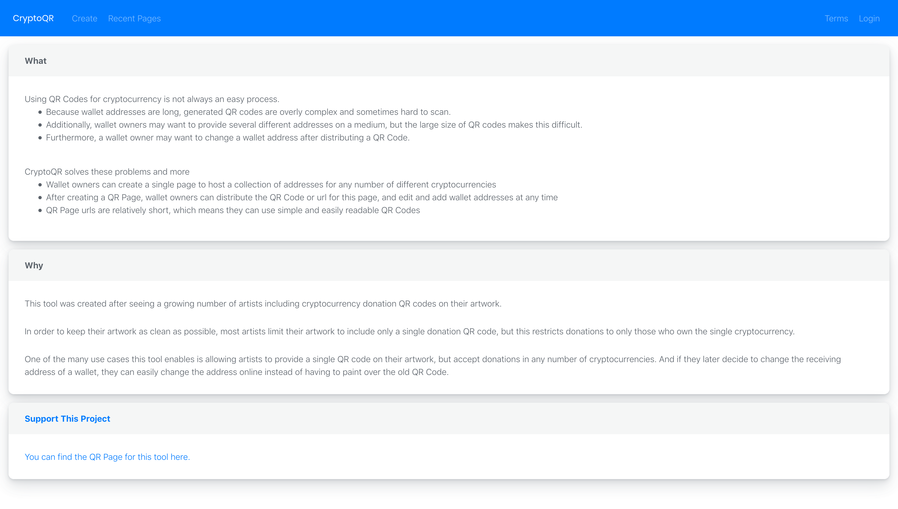
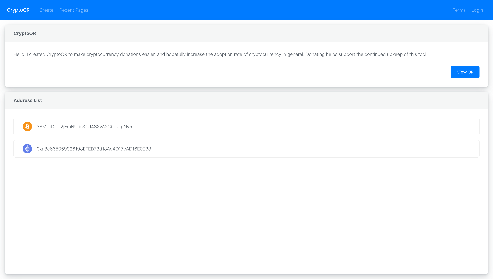
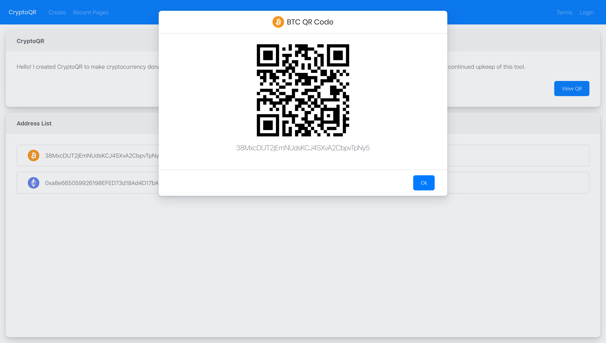
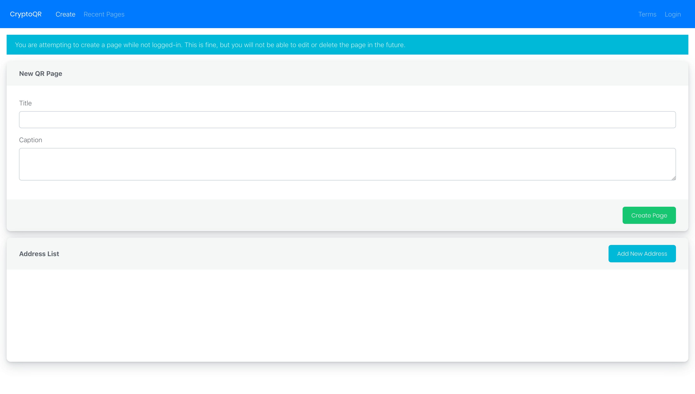

# CryptoQR
A tool to generate a single QR code to receive payments in multiple cryptocurrencies

## Why
* This tool was created after seeing a growing number of artists including cryptocurrency donation QR codes on their artwork.
* In order to keep their artwork as clean as possible, most artists limit their artwork to include only a single donation QR code, but this restricts donations to only those who own the single cryptocurrency.
* One of the many use cases this tool enables is allowing artists to provide a single QR code on their artwork, but accept donations in any number of cryptocurrencies. And if they later decide to change the receiving address of a wallet, they can easily change the address online instead of having to paint over the old QR Code.

## Status
The public (but currently unannounced beta) version of this tool has been released!
You can use it at [coinqr.io](https://coinqr.io)!

## Tech Stack
* **React.js**: Front-end
* **Next.js**: Framework for using React with Server-Side Rendering
* **Node.js**/**Express**: Back-end server
* **Firebase**: Authentication and database

## Design Stack
* **Bootstrap**: For the base CSS
* **Shards React**: Expanded Bootstrap components and React implementation
* **react-jss**: For CSS-in-JS

---

### Terms
The full Terms of Use can be found in the Terms component and will be on the website, but to be simple:
This tool and its creator is not responsible for lost or incorrectly sent funds.

---

### Screenshots

